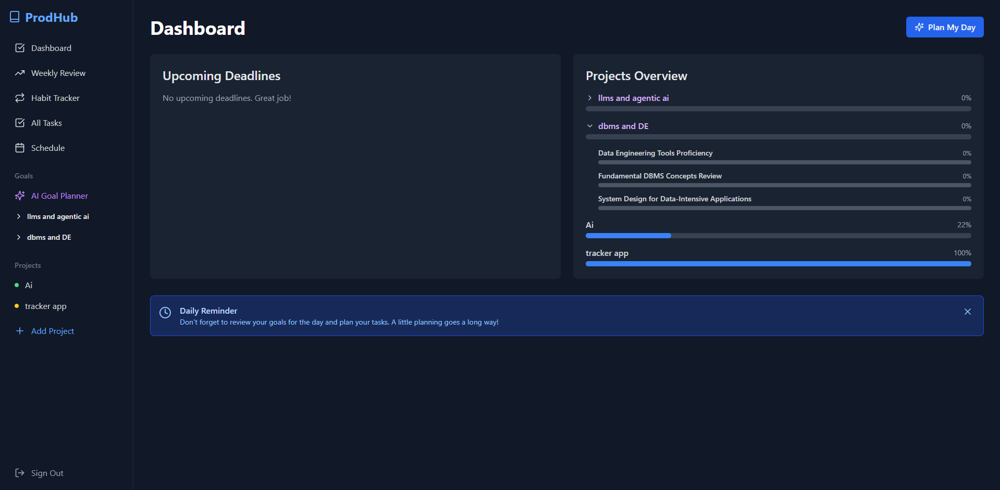

# ProdHub: Empowering Your Productivity

**Take control of your growth—professionally, personally, and daily.**  
ProdHub is a modern, all-in-one web application built to help you organize, achieve, and grow. Seamlessly manage projects, tasks, habits, and your calendar from a single, intuitive platform—all with smart AI-powered features and robust security.

**Try ProdHub Now**  
We are available at: [https://my-productivity-hub-5a3ba.web.app/](https://my-productivity-hub-5a3ba.web.app/)



## Key Features

**Dashboard Overview**

Get a snapshot of your productivity: overdue tasks, upcoming deadlines, and overall progress all at a glance. With the AI Daily Planner, you can get a prioritized and motivational schedule for your day with a single click.

**AI-Powered Goal Decomposition**

Don't just manage projects; create them with purpose. Give the AI Goal Planner a high-level goal like "Learn web development," and it will intelligently break it down into a structured plan with multiple sub-projects and all the necessary tasks, neatly organized in your sidebar.

**Hierarchical Project Management**

Track everything from courses and conferences to personal projects. Projects can be created manually or generated by the AI as part of a larger goal. Each project gets its own page with a dynamic progress bar that updates as you complete tasks.

**Task Management**

Break down projects into actionable steps. Set priorities (High, Medium, Low), assign due dates, and check off completed tasks with ease.

**Advanced AI-Powered Planning (Gemini API Integrated)**

ProdHub uses the Google Gemini API for smart, context-aware planning:

- **Goal Decomposition:** Turns your big ambitions into actionable projects. And with Ai gemerated pre tasks for better understanding.

- **Daily Planning:** Creates a prioritized daily schedule based on your tasks and calendar.

  - Smart Scheduling: The "Plan My Day" button on the dashboard will trigger an AI that acts as a productivity coach. It will analyze overdue tasks, today's high-priority items, and your fixed Google Calendar appointments.

  - Actionable Output: Instead of just a list, the AI will generate a suggested schedule with time blocks and priorities. It will be presented in a clean, easy-to-read modal. For example, it might suggest: "9:00 AM - 10:00 AM: Focus on 'Draft Project Proposal' (Overdue Task)" and then slot other tasks around your scheduled meetings.

  - Context-Aware: If you haven't synced your calendar, the planner will still work with your tasks but will also gently remind you that connecting your calendar can lead to even better plans.

- **Task Generation:** Generates intelligent task lists for your projects, using your project title and synced Google Calendar events for context.

**Habit Tracker:** Build better routines with a full-featured habit tracker. Set daily habits, check them off, and track your consistency and streaks over time. You can easily edit or delete habits as your goals evolve.

**Unified Schedule:** See all your project deadlines, task due dates (including overdue items), and Google Calendar events beautifully organized in one timeline - no more switching between apps.

**Secure Calendar Integration:** Sync your Google Calendar securely and privately. ProdHub only reads event information to help you plan and never stores or modifies your calendar data. Your data stays yours.

<!--**Persistent, Private Data:**

Everything you add is saved in real-time to your secure, private Firebase account. Your information is always up-to-date and accessible wherever you are.

**Safe Sign-In:**

Log in with Google or a traditional email and password. ProdHub prioritizes your privacy and security every step of the way.-->

## Technology

ProdHub is built for speed, reliability, and a great user experience.

- **Frontend:** React.js
- **Backend & Database:** Firebase (Firestore, Authentication)
- **Styling:** Tailwind CSS
- **AI Integration:** Google Gemini API
- **Calendar Integration:** Google Calendar API via Google Identity Services

## Get Started with ProdHub

Follow these steps to run ProdHub locally and customize it for your workflow.

#### Prerequisites

- **Node.js** (v18 or later): [Download Here](https://nodejs.org/)
- **Firebase CLI** (install globally):  
  `npm install -g firebase-tools`
- **Google Account** (for Firebase and Google Cloud projects)

#### 1. Clone the Repository

```sh
git clone https://github.com/Rupesh4604/my-productivity-hub.git
cd my-productivity-hub
```

#### 2. Install Dependencies

```sh
npm install
```

#### 3. Set Up Firebase

- **Create a Firebase project** at the [Firebase Console](https://console.firebase.google.com/).
- **Enable Firestore:** Go to **Build > Firestore Database** and create a database in Production mode.
- **Update Firestore Rules:** In the **Rules** tab, paste:

  ```
  rules_version = '2';
  service cloud.firestore {
    match /databases/{database}/documents {
      match /artifacts/{appId}/users/{userId}/{document=**} {
        allow read, write: if request.auth != null && request.auth.uid == userId;
      }
    }
  }
  ```

- **Enable Authentication:** Go to **Build > Authentication**, click **Get Started**, and enable Google and Email/Password sign-in.

#### 4. Google Cloud Platform & API Keys

- **Google Calendar:**  
  Enable the Google Calendar API, configure the OAuth consent screen, and get your Client ID using the project documentation.
- **Gemini API:**  
  Visit [Google AI Studio](https://aistudio.google.com/) to create and copy your Gemini API key.

#### 5. Configure Environment Variables

Create a `.env.local` file in your project root and add:

```env
# FIREBASE CONFIGURATION
REACT_APP_FIREBASE_API_KEY="YOUR_API_KEY"
REACT_APP_FIREBASE_AUTH_DOMAIN="YOUR_AUTH_DOMAIN"
REACT_APP_FIREBASE_PROJECT_ID="YOUR_PROJECT_ID"
REACT_APP_FIREBASE_STORAGE_BUCKET="YOUR_STORAGE_BUCKET"
REACT_APP_FIREBASE_MESSAGING_SENDER_ID="YOUR_SENDER_ID"
REACT_APP_FIREBASE_APP_ID="YOUR_APP_ID"

# GOOGLE API KEYS
REACT_APP_GOOGLE_CLIENT_ID="YOUR_GOOGLE_CLIENT_ID"
REACT_APP_GEMINI_API_KEY="YOUR_GEMINI_API_KEY"
```

Update `src/App.js` to use these variables for your `firebaseConfig`.

#### 6. Run and Deploy

- **Start locally:**  
  `npm start` (opens at `http://localhost:3000`)
- **Build:**  
  `npm run build`
- **Deploy:**  
  `firebase deploy` (ensure `firebase.json` is set to use the `build` folder)

## Running with Docker 🐳

This project is fully containerized, allowing you to run it in a consistent and isolated environment with a single command.

### Prerequisites

- [Docker Desktop](https://www.docker.com/products/docker-desktop/) installed and running on your machine.

### Quick Start

1.  **Clone the Repository**

    ```bash
    git clone [https://github.com/Rupesh4604/my-productivity-hub.git](https://github.com/Rupesh4604/my-productivity-hub.git)
    cd ProdHub
    ```

2.  **Create an Environment File**
    Create a file named `.env` in the root of the project. This file will hold your secret keys. Copy the contents of `.env.local` or add the following variables, replacing the placeholder values with your actual credentials:

    ```env
    REACT_APP_FIREBASE_API_KEY=AIzaSy...
    REACT_APP_FIREBASE_AUTH_DOMAIN=your-project-id.firebaseapp.com
    REACT_APP_FIREBASE_PROJECT_ID=your-project-id
    REACT_APP_FIREBASE_STORAGE_BUCKET=your-project-id.appspot.com
    REACT_APP_FIREBASE_MESSAGING_SENDER_ID=1234567890
    REACT_APP_FIREBASE_APP_ID=1:1234567890:web:abcdef123456
    REACT_APP_GOOGLE_CLIENT_ID=your-google-client-id.apps.googleusercontent.com
    REACT_APP_GEMINI_API_KEY=your-gemini-api-key
    ```

3.  **Build and Run the Container**
    Open your terminal in the project root and run the following command:

    ```bash
    docker-compose up --build
    ```

    This command will build the Docker image based on the `Dockerfile` and then start the container.

4.  **Access the Application**
    Once the container is running, open your web browser and navigate to:
    [**http://localhost:3000**](http://localhost:3000)

    You should see the ProdHub application running live! To stop the application, press `Ctrl + C` in your terminal.


**Start your journey with ProdHub today.**

<!-- ## Our Organization

OpenSourceEnv is a dedicated initiative focused on democratizing access to high-quality education in various domains of technology. Our mission is to provide comprehensive resources that empower learners at all levels to master new skills and technologies. We are committed to fostering an inclusive learning environment where everyone can thrive.

Community Page: [OpenSourceEnv Teamspace](https://www.notion.so/Teamspace-Home-913399bce8764b36ad8e928a0083af45)

Github: https://github.com/openSourceEnv

-->

## License

This project is licensed under the MIT License. For details, refer to the LICENSE.md file. You can find terms & conditions and other privacy related details at [prodhub-info](https://github.com/Rupesh4604/prodhub-info/tree/main).

<!-- ## Contact

Created by: Rupesh Kumar Yadav Mediboyina, Email: rupesh32003@gmail.com

LinkedIn: www.linkedin.com/in/mediboyina-rupesh-kumar-yadav-8b7a14205 -->
